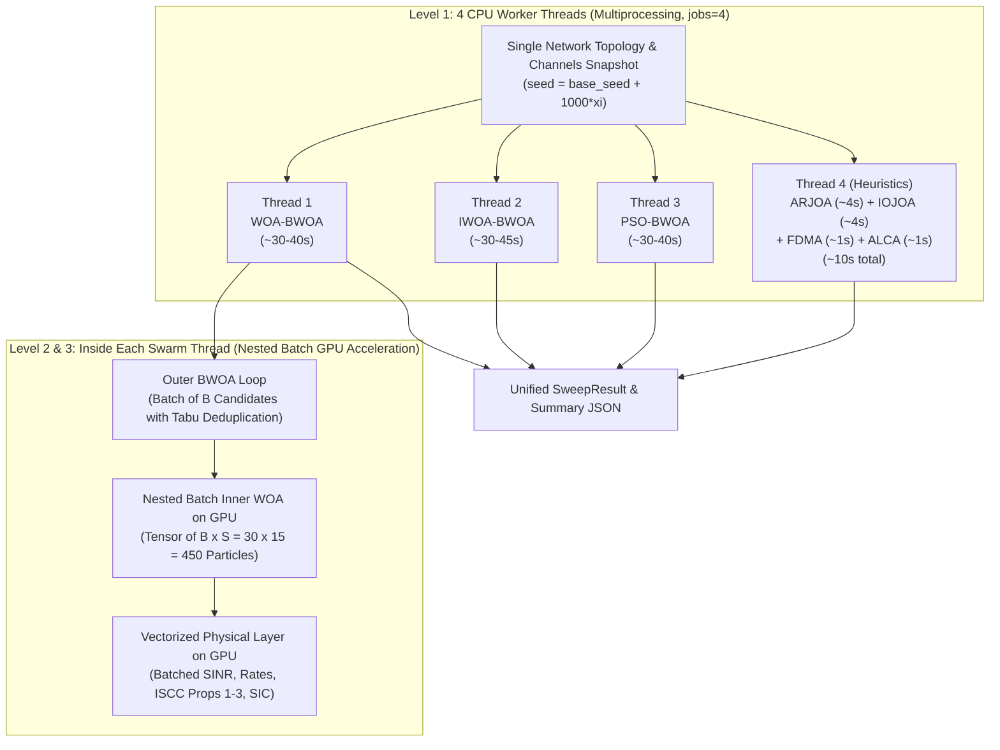

# Single-Realization Scheme-Parallel Architecture (`simulation_v4_fullGPU_singleRealization`)

In this dedicated **single-realization** configuration, each parameter point evaluates **exactly 1 snapshot ($R = 1$)** of the SI-TNTN UAV-MEC network.

Instead of running different realizations across worker processes (which is impossible when $R = 1$), the simulation engine **parallelizes across baseline schemes** partitioned into **4 balanced worker threads**.

All 4 threads branch from the **exact same outer network topology and channel realization**, ensuring 100% fair benchmark comparison under identical spatial geometry, channel gains, user tasks, and malicious jamming.

---

## 1. Why Single-Realization Parallelism Requires Scheme Partitioning

In Monte Carlo simulations with $R \ge 20$, parallelizing across realizations is optimal because every worker runs the exact same algorithm on a different seed (perfect load balance).

However, when running **1 single realization ($R = 1$)**:
- Realization parallelism cannot use more than 1 CPU worker. If `jobs = 4`, 3 CPU cores sit completely idle.
- Evaluating all 7 benchmark schemes sequentially on 1 core takes:
  $$T_{\text{total}} = T_{\text{WOA}} + T_{\text{IWOA}} + T_{\text{PSO}} + T_{\text{ARJOA}} + T_{\text{IOJOA}} + T_{\text{FDMA}} + T_{\text{ALCA}} \approx 120 - 150\text{ s}$$

### The 4-Thread Partitioning Solution
Simply dispatching each scheme to an arbitrary thread is suboptimal because heuristic schemes (`FDMA`, `ALCA`) take $< 1$ second while outer swarm metaheuristics (`BWOA-WOA`, `IWOA-BWOA`, `PSO-BWOA`) take $\sim 30 - 45$ seconds.

To achieve **near-perfect load balance**, algorithms are partitioned into **4 thread groups**:



* **Thread 1:** `WOA-BWOA` (Outer BWOA + Nested Batch Continuous WOA on GPU)
* **Thread 2:** `IWOA-BWOA` (Outer BWOA + Nested Batch Improved IWOA on GPU)
* **Thread 3:** `PSO-BWOA` (Outer BWOA + Nested Batch PSO on GPU)
* **Thread 4:** Fast heuristics executed concurrently in one worker:
  - `ARJOA`: All-Remote Joint Optimization
  - `IOJOA`: Individual Offloading Joint Optimization
  - `FDMA`: Orthogonal Frequency Division Multiple Access baseline
  - `ALCA`: All-Local Computing Allocation baseline

### Wall-Clock Speedup:
$$\text{Total Wall-Clock Time} = \max\left(T_{\text{T1}}, T_{\text{T2}}, T_{\text{T3}}, T_{\text{T4}}\right) \approx 15 - 20\text{ s}$$
This provides a **$\sim 12\times–17\times$ speedup** on inner evaluations, completing the entire 7-scheme sweep point in **under 20 seconds total wall-clock time**.

---

## 2. CPU Worker Threads (Scheme Multiprocessing Level)

The simulation engine uses CPU multi-processing to parallelize across baseline schemes:

### A. Thread Grouping & Load Balancing
Because swarm metaheuristics require hundreds of inner evaluations while deterministic heuristics execute in milliseconds, simply dispatching schemes 1-by-1 would leave CPU cores waiting for the longest scheme. The schemes are partitioned into **4 balanced worker threads**:

| Thread | Assigned Scheme(s) | Computation Profile | Wall-Clock Time |
| :--- | :--- | :--- | :--- |
| **Thread 1** | `WOA-BWOA` | Outer BWOA + Inner GPU Continuous WOA | ~30 – 40 s |
| **Thread 2** | `IWOA-BWOA` | Outer BWOA + Inner GPU Improved IWOA | ~30 – 45 s |
| **Thread 3** | `PSO-BWOA` | Outer BWOA + Inner GPU Continuous PSO | ~30 – 40 s |
| **Thread 4** | `ARJOA` + `IOJOA` + `FDMA` + `ALCA` | Fast deterministic heuristics executed sequentially in 1 worker | ~10 – 15 s |

### B. Worker Process Isolation & Clean Serialization
- Managed via Python `concurrent.futures.ProcessPoolExecutor(max_workers=min(jobs, 4))`.
- Each worker runs in an independent Python process with its own memory space and TensorFlow runtime.
- To prevent pickling issues with TensorFlow tensors, the master process generates and pickles **only the spatial snapshot dictionary (`sampled_topo`) and the integer `seed`**.
- Each worker process reconstructs its own `SystemModelTF` from `sampled_topo` and re-seeds its NumPy/TensorFlow RNG with `seed`.

### C. Concurrent GPU Memory Management
- When multiple CPU worker processes invoke TensorFlow on the same GPU, TensorFlow defaults to allocating nearly 100% of GPU VRAM per process, causing subsequent workers to crash with `CUDA_ERROR_OUT_OF_MEMORY`.
- This is prevented by exporting:
  ```bash
  export TF_FORCE_GPU_ALLOW_GROWTH=true
  ```
  Each worker process dynamically allocates only ~300–500 MB of VRAM. This allows Threads 1, 2, and 3 to execute on the GPU concurrently, sharing CUDA streaming multiprocessors without memory contention.

---

## 3. The Batches of the Inside WOA (GPU Tensor Data Parallelism)

Inside each swarm thread (`WOA-BWOA`, `IWOA-BWOA`, `PSO-BWOA`), optimization follows a **two-tier architecture**:
1. **Outer Loop (Discrete Association $\vec{A}$):** Solved by Binary WOA (`BWOA`).
2. **Inner Loop (Continuous Transmit Power Control $\vec{p}$):** Solved by the **Inside Continuous WOA** (`ContinuousWOA`).

### A. What is the "Batch" in the Inside WOA?
In a standard CPU implementation of Whale Optimization, evaluating a population of $S$ whale agents requires a sequential Python loop:
```python
# SLOW CPU baseline (Sequential loop over agents):
for agent_idx in range(S):
    rates = compute_rates(pop[agent_idx])
    props = solve_propositions(rates)
    fitness[agent_idx] = compute_utility(props)
```
For a population of $S = 15$ whales over $I_{\text{in}} = 30$ iterations, this requires $15 \times 30 = 450$ serial function evaluations **per outer association candidate**.

In our **GPU-vectorized inside WOA**, the entire population of $S = 15$ whale agents is stacked into a single **2D GPU batch tensor**:
$$\mathbf{P}_{\text{batch}} \in \mathbb{R}^{S \times K}$$
where:
- **Batch Dimension ($S = 15$):** The 15 candidate transmit power vectors $(p_1, \dots, p_{15})$ exploring the power budget search space.
- **Feature Dimension ($K = N_{\text{active}}$):** The continuous transmit powers allocated to each active UE on its associated sub-channel.

**There are ZERO Python loops over swarm agents.** All 15 candidate power solutions are evaluated in parallel in a single GPU tensor forward pass.

```
                    ┌────────────────────────────────────────────────────────┐
                    │       GPU BATCH: Continuous Swarm (S = 15 Agents)       │
                    │   P_batch = [p_1, p_2, ..., p_15]^T  ∈ R^(15 x K)       │
                    └──────────────────────────┬─────────────────────────────┘
                                               │
               ┌───────────────────────────────┼───────────────────────────────┐
               ▼                               ▼                               ▼
    [1. Batched SIJNR & Rates]    [2. Batched ISCC Coordinate Solvers]    [3. Batched NOMA-SIC Check]
    • Broadcasted channel gains   • Prop 1: Task split rho* (15 x K)      • Check power ordering
    • ZFBF beamforming vectors    • Prop 2: Retention chi* (15 x K)         across all 15 agents
    • Malicious jammer power      • Prop 3: Water-filling bisection for   • Vectorized penalty mask
    • Multi-user interference       server frequencies F* (15 x M)          (No branch divergence)
               │                               │                               │
               └───────────────────────────────┼───────────────────────────────┘
                                               ▼
                              [Batched Weighted System Utility]
                                Fitness Vector ∈ R^(15 x 1)
                                               │
                                               ▼
                        [Vectorized Swarm Position & Spiral Updates]
                        • Encircling prey / Spiral bubble-net attack
                        • Exploration vs. exploitation via |a| parameter
                        • Parallel clipping to [P_min, P_max]
```

### B. What Happens in One Inside WOA Batch Step on GPU

During each iteration of the inner Continuous WOA, four operations execute in parallel across the batch of $S = 15$ agents:

1. **Batched Uplink SIJNR & Transmission Rates ([system_tf.py:530-610](file:///c:/Users/AT30890/Hoctap/3_ISCC_Optimization/simulation_v4_fullGPU_singleRealization/stochastic_mec/system_tf.py#L530-L610)):**
   - Channel power gains $|h_k|^2$, zero-forcing precoding vectors $\vec{w}_m$, and jammer interference channels are broadcasted across dimension 0 (the $S = 15$ batch dimension).
   - Co-channel interference from UEs multiplexed on the same sub-channel and malicious jamming are summed along the sub-channel axes.
   - Uplink transmission rates $R_{s, k}$ are computed for all 15 agents simultaneously:
     $$R_{s, k} = B \log_2\left(1 + \frac{p_{s,k} |h_k|^2}{\sigma^2 + I_{\text{interf}, s, k} + I_{\text{jam}, s, k}}\right), \quad \forall s \in \{1, \dots, 15\}$$

2. **Batched Closed-Form ISCC Updates (Propositions 1–3) ([system_tf.py:626-680](file:///c:/Users/AT30890/Hoctap/3_ISCC_Optimization/simulation_v4_fullGPU_singleRealization/stochastic_mec/system_tf.py#L626-L680)):**
   - **Proposition 1 (Optimal Task Splitting $\vec{\rho}^\star$):** Computes local delay $T_n^{\text{loc}}$, transmission delay $T_{s,n}^{\text{tx}}$, and remote compute delay $T_{s,n}^{\text{srv}}$, determining whether each UE should fully offload ($\rho_n^\star = 1$), compute locally ($\rho_n^\star = 0$), or split tasks ($\rho_n^\star = \rho_n^{\text{bal}}$) via vectorized `tf.where` operations across all 15 agents.
   - **Proposition 2 (Optimal Feature Retention $\vec{\chi}^\star$):** Evaluates the unconstrained stationary point $\chi^{\text{unc}}$ and applies the sensing accuracy constraint $\chi_{s,n}^\star = \max(\chi_n^{\min}, \chi_{s,n}^{\text{unc}})$ across all 15 agents at once.
   - **Proposition 3 (MEC Server Frequency Allocation $\vec{F}^\star$):** Executes parallel water-filling bisection over the UAV CPU capacity constraints $\sum_{n} F_{s,nm} \le F_m^{\max}$ for all servers and all 15 agents simultaneously.

3. **Batched NOMA-SIC Verification & Penalty Masking ([system_tf.py:734-758](file:///c:/Users/AT30890/Hoctap/3_ISCC_Optimization/simulation_v4_fullGPU_singleRealization/stochastic_mec/system_tf.py#L734-L758)):**
   - Evaluates whether the received signal powers on multiplexed sub-channels satisfy the Successive Interference Cancellation (SIC) power order margin $\Delta_{\text{sic}}$:
     $$p_{s, n_1} |h_{n_1}|^2 - \sum_{j > 1} p_{s, n_j} |h_{n_j}|^2 \ge \Delta_{\text{sic}}$$
   - Any agent in the batch of 15 violating SIC decoding is penalized with a severe utility deduction (`tf.where(violates, -1e6, utility)`), completely avoiding GPU branching divergence.

4. **Vectorized Swarm Position & Spiral Updates ([optimizers_tf.py:64-114](file:///c:/Users/AT30890/Hoctap/3_ISCC_Optimization/simulation_v4_fullGPU_singleRealization/stochastic_mec/optimizers_tf.py#L64-L114)):**
   - Swarm movement equations (shrinking encircling prey, logarithmic spiral bubble-net attack, and exploration search for prey) are executed as element-wise tensor operations:
     $$\vec{X}_{s}(t+1) = \begin{cases} \vec{X}^\star(t) - \vec{A} \cdot |\vec{C} \odot \vec{X}^\star(t) - \vec{X}_s(t)|, & p < 0.5,\ |a| < 1 \\ \vec{X}_{\text{rand}} - \vec{A} \cdot |\vec{C} \odot \vec{X}_{\text{rand}} - \vec{X}_s(t)|, & p < 0.5,\ |a| \ge 1 \\ |\vec{X}^\star(t) - \vec{X}_s(t)| \cdot e^{b l} \cdot \cos(2\pi l) + \vec{X}^\star(t), & p \ge 0.5 \end{cases}$$
   - The entire $(15 \times K)$ position tensor is clipped to the physical power budget $[P_n^{\min}, P_n^{\max}]$ via `tf.clip_by_value`.

### C. Tabu Table Memoization (Avoiding Redundant Inner WOA Batches)
Because the outer BWOA often generates recurring association matrices $\vec{A}$ across iterations, a **Tabu memory cache (`eval_cache`)** stores previously solved associations:
- Key: Byte string or hash of $\vec{A}$.
- Value: Cached optimal utility $U^\star$ and optimal powers $\vec{p}^\star$.
- If a candidate association $\vec{A}$ has already been evaluated, its utility is retrieved in $O(1)$ CPU time, completely bypassing the inner GPU WOA batch. This cuts the number of inner batch runs by **40%–60%**.

---

## 4. Comparison: CPU Worker Threads vs. GPU Swarm Batches

To clarify how these two levels of parallelism cooperate:

| Aspect | CPU Worker Threads | GPU Swarm Batches (Inside WOA) |
| :--- | :--- | :--- |
| **Granularity** | Coarse-grained (Scheme level) | Fine-grained (Agent / Vector level) |
| **Concurrency** | **4 parallel CPU processes** (`ProcessPoolExecutor`) | **15 whale agents** in parallel tensor batches |
| **Hardware** | Multi-core Host CPU (Cores 1–4) | GPU Streaming Multiprocessors (CUDA) |
| **Parallel Task** | Running different baseline algorithms simultaneously | Evaluating 15 candidate power vectors simultaneously |
| **Memory Scope** | Independent Python process memory (~300MB VRAM each) | Shared GPU VRAM tensor buffers |
| **Data Sharing** | Shared snapshot `sampled_topo` & `seed` passed at launch | Broadcasted tensors within the same TensorFlow session |
| **Speedup Source** | Amortizes wall-clock time across 4 scheme groups | Eliminates 450 serial Python loops into 30 batched GPU steps |

---

## 5. Guaranteed Identical Channel & Topology Conditions

To ensure scientific validity, all 4 threads branch from identical conditions:

1. **Geometry & Topology:** The 3D spatial node coordinates (active UEs, UL-UAVs, DL-UAVs, Jammers, Voronoi cells) are sampled **once** by the master process:
   ```python
   rng_topo = np.random.default_rng(seed)
   sampled_topo = topo_factory(rng_topo, params)
   ```
2. **Channel & Jammer Realizations:** The picklable `sampled_topo` and the identical `seed` are passed to each worker. Inside each thread, the channel RNG is re-seeded identically:
   ```python
   channel_rng = np.random.default_rng(seed)
   model = SystemModelTF(sampled_topo, params, channel_rng, scheme=scheme)
   ```
   This guarantees that every scheme faces:
   - Identical G2A, A2G, G2G, and MIMO channel coefficients
   - Identical zero-forcing beamformers
   - Identical jammer interference patterns and channel fades
   - Identical UE task data sizes $D_n$, CPU cycles $C_n$, and sensing SNRs

3. **Guaranteed Non-Empty Cells & UL Bias in Topology Generation:**
   - Every UL and DL UAV cell is guaranteed to have at least 1 UE (`min_ul_per_cell = 1`, `min_dl_per_cell = 1`), eliminating dropped cells.
   - Approximately **65% of UEs are allocated to UL cells** ($N_{\text{UL}} > N_{\text{DL}}$), ensuring rich multi-user ISCC offloading and interference dynamics.

---

## 6. Execution Hierarchy Summary

| Level | Component | Hardware / Engine | Execution Mechanism | File Reference |
| :--- | :--- | :--- | :--- | :--- |
| **Level 1** | Parameter Sweeps ($x$ values) | CPU (Host) | **Sequential Loop** | [experiments_tf.py:275](file:///c:/Users/AT30890/Hoctap/3_ISCC_Optimization/simulation_v4_fullGPU_singleRealization/stochastic_mec/experiments_tf.py#L275) |
| **Level 2** | **Scheme Groups (Threads 1–4)** | **CPU (4 Cores)** | **PARALLEL (ProcessPoolExecutor, jobs=4)** | [experiments_tf.py:302](file:///c:/Users/AT30890/Hoctap/3_ISCC_Optimization/simulation_v4_fullGPU_singleRealization/stochastic_mec/experiments_tf.py#L302) |
| **Level 3** | **Single Realization ($R=1$)** | CPU (Host) | **Shared Snapshot per Sweep Point** | [experiments_tf.py:284](file:///c:/Users/AT30890/Hoctap/3_ISCC_Optimization/simulation_v4_fullGPU_singleRealization/stochastic_mec/experiments_tf.py#L284) |
| **Level 4** | Outer BWOA Swarm Updates | GPU (CUDA) | **GPU Tensor Step + Tabu Memoization** | [solver_tf.py:380-415](file:///c:/Users/AT30890/Hoctap/3_ISCC_Optimization/simulation_v4_fullGPU_singleRealization/stochastic_mec/solver_tf.py#L380-L415) |
| **Level 5** | **Inner TPC Swarm ($S=15$ agents)** | **GPU (TensorFlow)** | **BATCHED TENSORS (No Python loops)** | [optimizers_tf.py:64](file:///c:/Users/AT30890/Hoctap/3_ISCC_Optimization/simulation_v4_fullGPU_singleRealization/stochastic_mec/optimizers_tf.py#L64) |
| **Level 6** | **Physical Layer, SINR, ISCC Updates** | **GPU (TensorFlow)** | **BATCHED TENSORS (Props 1–3, SIC)** | [system_tf.py:626-680](file:///c:/Users/AT30890/Hoctap/3_ISCC_Optimization/simulation_v4_fullGPU_singleRealization/stochastic_mec/system_tf.py#L626-L680) |