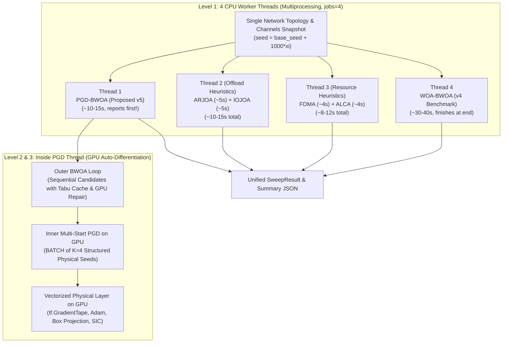

# Single-Realization Scheme-Parallel Architecture (`simulation_v5_PGD_singleRealization`)

In this dedicated **single-realization** configuration, each parameter point evaluates **exactly 1 snapshot ($R = 1$)** of the SI-TNTN UAV-MEC network.

Instead of running different realizations across worker processes (which is impossible when $R = 1$), the simulation engine **parallelizes across baseline schemes** partitioned into **4 balanced worker threads**.

All 4 threads branch from the **exact same outer network topology and channel realization**, ensuring 100% fair benchmark comparison under identical spatial geometry, channel gains, user tasks, and malicious jamming.

---

## 1. Why Single-Realization Parallelism Requires Scheme Partitioning

In Monte Carlo simulations with $R \ge 20$, parallelizing across realizations is optimal because every worker runs the exact same algorithm on a different seed (perfect load balance).

However, when running **1 single realization ($R = 1$)**:
- Realization parallelism cannot use more than 1 CPU worker. If `jobs = 4`, 3 CPU cores sit completely idle.
- Evaluating all 7 benchmark schemes sequentially on 1 core takes:
  $$T_{\text{total}} = T_{\text{PGD-BWOA}} + T_{\text{IWOA}} + T_{\text{PSO}} + T_{\text{ARJOA}} + T_{\text{IOJOA}} + T_{\text{FDMA}} + T_{\text{ALCA}} \approx 80 - 120\text{ s}$$

### The 4-Thread Partitioning Solution
To achieve **near-perfect load balance** and ensure the proposed algorithm reports results first, algorithms are partitioned into **4 thread groups**:



* **Thread 1:** `PGD-BWOA` (Proposed: outer BWOA + inner Multi-Start PGD on GPU — **completes and reports first!**)
* **Thread 2:** `ARJOA` + `IOJOA` (Offloading baselines with inner PGD)
* **Thread 3:** `FDMA` + `ALCA` (Resource & local computing baselines with inner PGD)
* **Thread 4:** `WOA-BWOA` (Previous v4 swarm benchmark — runs in parallel on its own thread and completes at the end)

### Wall-Clock Speedup:
$$\text{Total Wall-Clock Time} = \max\left(T_{\text{T1}}, T_{\text{T2}}, T_{\text{T3}}, T_{\text{T4}}\right) \approx T_{\text{WOA}} \approx 30 - 40\text{ s}$$
This provides a **$\sim 3.5\times–4\times$ speedup** over sequential execution on multi-core systems, while immediately reporting the primary `PGD-BWOA` result within the first ~10–15 seconds!

---

## 2. CPU Worker Threads (Scheme Multiprocessing Level)

The simulation engine uses CPU multi-processing to parallelize across baseline schemes:

### A. Thread Grouping & Load Balancing
Because swarm metaheuristics require hundreds of inner evaluations while deterministic heuristics execute quickly, the schemes are partitioned into **4 balanced worker threads**:

| Thread | Assigned Scheme(s) | Computation Profile | Wall-Clock Time |
| :--- | :--- | :--- | :--- |
| **Thread 1** | `PGD-BWOA` | **Proposed v5 scheme** (Multi-Start PGD with Adam on GPU) | ~10 – 15 s (**Reports first!**) |
| **Thread 2** | `ARJOA` + `IOJOA` | Offloading heuristics with inner PGD | ~10 – 15 s |
| **Thread 3** | `FDMA` + `ALCA` | Orthogonal and local computing heuristics with inner PGD | ~8 – 12 s |
| **Thread 4** | `WOA-BWOA` | Previous v4 swarm benchmark (Continuous WOA on GPU) | ~30 – 40 s (**Finishes at end**) |

### B. Worker Process Isolation & Clean Serialization
- Managed via Python `concurrent.futures.ProcessPoolExecutor(max_workers=min(jobs, 4))`.
- Each worker runs in an independent Python process with its own memory space and TensorFlow runtime.
- To prevent pickling issues with TensorFlow tensors, the master process generates and pickles **only the spatial snapshot dictionary (`sampled_topo`) and the integer `seed`**.
- Each worker process reconstructs its own `SystemModelTF` from `sampled_topo` and re-seeds its NumPy/TensorFlow RNG with `seed`.

### C. Concurrent GPU Memory Management
- When multiple CPU worker processes invoke TensorFlow on the same GPU, TensorFlow defaults to allocating nearly 100% of GPU VRAM per process, causing subsequent workers to crash with `CUDA_ERROR_OUT_OF_MEMORY`.
- This is prevented by exporting:
  ```bash
  export TF_FORCE_GPU_ALLOW_GROWTH=true
  ```
  Each worker process dynamically allocates only ~300–500 MB of VRAM. This allows Threads 1, 2, and 3 to execute on the GPU concurrently, sharing CUDA streaming multiprocessors without memory contention.

---

## 3. The Batches of the Inside Multi-Start PGD (GPU Tensor Data Parallelism)

Inside Thread 1 (`PGD-BWOA`) and Thread 4 (Heuristics), the continuous power allocation problem is solved by **Multi-Start Projected Gradient Descent (PGD)** on GPU.

### A. What is the "Batch" in the Inside PGD?
In the original WOA implementation, 15 continuous whale agents explore the power search space through random spirals and prey encircling.

In **Multi-Start PGD**, random heuristic exploration is replaced by **directed gradient descent with Adam**, initialized from **4 structured physical seeds**:
1. **Seed 1 ($p^{\max}$):** Full power budget (optimal in noise-limited or high-jamming regimes).
2. **Seed 2 ($p^\dagger$):** Analytical bisection root of $\phi_n(p) = 0$ (Lemma 1 interference-free optimal delay-energy tradeoff).
3. **Seed 3 ($p^{\text{half}}$):** Mid-range power $0.5(p_{\min} + p_{\max})$ (balanced regime).
4. **Seed 4 ($p^{\text{low}}$):** Low power budget $p_{\min} + 0.1(p_{\max} - p_{\min})$ (interference-saving regime).

These 4 seeds are stacked into a **2D GPU batch tensor**:
$$\mathbf{P}_{\text{seeds}} \in \mathbb{R}^{4 \times K}$$
where:
- **Batch Dimension ($K_{\text{seeds}} = 4$):** The 4 structured seed trajectories.
- **Feature Dimension ($K = N_{\text{active}}$):** The continuous transmit powers allocated to each active UE on its associated sub-channel.

**There are ZERO Python loops over seeds.** All 4 trajectories are evaluated and updated simultaneously in parallel on the GPU.

```
                    ┌────────────────────────────────────────────────────────┐
                    │      GPU BATCH: Multi-Start PGD (4 Structured Seeds)    │
                    │   P_seeds = [p_max, p_dag, p_half, p_low]^T ∈ R^(4 x K) │
                    └──────────────────────────┬─────────────────────────────┘
                                               │
                                               ▼
                              [tf.GradientTape Forward Evaluation]
                               • Broadcasted channel gains & ZFBF
                               • Batched SIJNR, ISCC closed-form props
                               • Differentiable system loss L(P)
                                               │
                                               ▼
                              [Auto-Differentiated Gradients]
                                 grads = tape.gradient(tot_loss, P)
                                 Clip gradient norm to 10.0
                                               │
                                               ▼
                              [Batched Adam Update on GPU]
                                 Update m, v first & second moments
                                 P_new = P - lr * m_hat / sqrt(v_hat)
                                               │
                                               ▼
                              [Exact Box Projection to Feasible Set]
                                 P_proj = tf.clip_by_value(P_new, P_min, P_max)
```

### B. What Happens in One Inside PGD Batch Step on GPU

During each iteration ($t = 1, \dots, I_{\text{pgd}}$, default $I_{\text{pgd}} = 10$), the following operations execute in parallel across all 4 seeds:

1. **Batched Forward Evaluation under `tf.GradientTape` ([optimizers_tf.py:295-300](file:///c:/Users/AT30890/Hoctap/3_ISCC_Optimization/simulation_v5_PGD_singleRealization/stochastic_mec/optimizers_tf.py#L295-L300)):**
   - Transmit power matrix $(4 \times K)$ is watched by the gradient tape.
   - Closed-form ISCC coordinate updates (Props 1–3) evaluate optimal task splitting $\rho_n^\star$, retention $\chi_n^\star$, and server capacities $F_{nm}^\star$ across all 4 seeds in parallel.
   - Evaluates the total weighted system utility objective $W(\vec{p})$ for each seed simultaneously.

2. **Auto-Differentiated Reverse-Mode Gradients ([optimizers_tf.py:301-308](file:///c:/Users/AT30890/Hoctap/3_ISCC_Optimization/simulation_v5_PGD_singleRealization/stochastic_mec/optimizers_tf.py#L301-L308)):**
   - Backpropagates exact gradients $\nabla_{\vec{p}} W(\vec{p})$ through the mathematical graph.
   - Replaces non-finite values with 0 and clips gradient norms to prevent exploding gradients.

3. **Batched Adam Optimizer Update ([optimizers_tf.py:309-317](file:///c:/Users/AT30890/Hoctap/3_ISCC_Optimization/simulation_v5_PGD_singleRealization/stochastic_mec/optimizers_tf.py#L309-L317)):**
   - Updates first moment $\vec{m}_t = \beta_1 \vec{m}_{t-1} + (1-\beta_1) \vec{g}_t$ and second moment $\vec{v}_t = \beta_2 \vec{v}_{t-1} + (1-\beta_2) \vec{g}_t^2$ across all 4 seeds in parallel.
   - Applies bias correction $\hat{m}_t, \hat{v}_t$ and computes the adaptive step.

4. **Exact Feasible Set Box Projection ([optimizers_tf.py:319-320](file:///c:/Users/AT30890/Hoctap/3_ISCC_Optimization/simulation_v5_PGD_singleRealization/stochastic_mec/optimizers_tf.py#L319-L320)):**
   - Projects the updated power vector back into the physical budget $[P_n^{\min}, P_n^{\max}]$ via `tf.clip_by_value`.

5. **Selection of Best Trajectory ([optimizers_tf.py:326-337](file:///c:/Users/AT30890/Hoctap/3_ISCC_Optimization/simulation_v5_PGD_singleRealization/stochastic_mec/optimizers_tf.py#L326-L337)):**
   - After 10 iterations, the seed achieving the maximum system utility is selected via `tf.argmin` over loss, returning the optimal power allocation $\vec{p}^\star$.

### C. Tabu Table Memoization (Avoiding Redundant Inner PGD Solves)
Because the outer BWOA often explores recurring association matrices $\vec{A}$ across iterations, a **Tabu memory cache (`eval_cache`)** stores previously solved associations:
- Key: Byte string or hash of $\vec{A}$.
- Value: Cached optimal utility $U^\star$ and optimal powers $\vec{p}^\star$.
- If a candidate association $\vec{A}$ has already been evaluated, its utility is retrieved in $O(1)$ CPU time, completely bypassing the inner GPU PGD solver. This cuts the number of inner PGD calls by **40%–60%**.

---

## 4. Comparison: CPU Worker Threads vs. GPU PGD Batches

| Aspect | CPU Worker Threads | GPU Multi-Start PGD Batches |
| :--- | :--- | :--- |
| **Granularity** | Coarse-grained (Scheme level) | Fine-grained (Seed / Gradient level) |
| **Concurrency** | **4 parallel CPU processes** (`ProcessPoolExecutor`) | **4 structured physical seeds** in parallel tensor batches |
| **Hardware** | Multi-core Host CPU (Cores 1–4) | GPU Streaming Multiprocessors (CUDA) |
| **Parallel Task** | Running different baseline algorithms simultaneously | Evaluating and updating 4 gradient trajectories simultaneously |
| **Optimization Method** | Process scheduling across CPU cores | Auto-differentiation (`tf.GradientTape`) + Adam + Box Projection |
| **Memory Scope** | Independent Python process memory (~300MB VRAM each) | Shared GPU VRAM tensor buffers |
| **Speedup Source** | Amortizes wall-clock time across 4 scheme groups (~3.5×) | 10 directed gradient steps replace 900 heuristic swarm evaluations (~10×) |

---

## 5. Guaranteed Identical Channel & Topology Conditions

To ensure scientific validity, all 4 threads branch from identical conditions:

1. **Geometry & Topology:** The 3D spatial node coordinates (active UEs, UL-UAVs, DL-UAVs, Jammers, Voronoi cells) are sampled **once** by the master process:
   ```python
   rng_topo = np.random.default_rng(seed)
   sampled_topo = topo_factory(rng_topo, params)
   ```
2. **Channel & Jammer Realizations:** The picklable `sampled_topo` and the identical `seed` are passed to each worker. Inside each thread, the channel RNG is re-seeded identically:
   ```python
   channel_rng = np.random.default_rng(seed)
   model = SystemModelTF(sampled_topo, params, channel_rng, scheme=scheme)
   ```
   This guarantees that every scheme faces:
   - Identical G2A, A2G, G2G, and MIMO channel coefficients
   - Identical zero-forcing beamformers
   - Identical jammer interference patterns and channel fades
   - Identical UE task data sizes $D_n$, CPU cycles $C_n$, and sensing SNRs

3. **Guaranteed Non-Empty Cells & UL Bias in Topology Generation:**
   - Every UL and DL UAV cell is guaranteed to have at least 1 UE (`min_ul_per_cell = 1`, `min_dl_per_cell = 1`), eliminating dropped cells.
   - Approximately **65% of UEs are allocated to UL cells** ($N_{\text{UL}} > N_{\text{DL}}$), ensuring rich multi-user ISCC offloading and interference dynamics.

---

## 6. Execution Hierarchy Summary

| Level | Component | Hardware / Engine | Execution Mechanism | File Reference |
| :--- | :--- | :--- | :--- | :--- |
| **Level 1** | Parameter Sweeps ($x$ values) | CPU (Host) | **Sequential Loop** | [experiments_tf.py:275](file:///c:/Users/AT30890/Hoctap/3_ISCC_Optimization/simulation_v5_PGD_singleRealization/stochastic_mec/experiments_tf.py#L275) |
| **Level 2** | **Scheme Groups (Threads 1–4)** | **CPU (4 Cores)** | **PARALLEL (ProcessPoolExecutor, jobs=4)** | [experiments_tf.py:305](file:///c:/Users/AT30890/Hoctap/3_ISCC_Optimization/simulation_v5_PGD_singleRealization/stochastic_mec/experiments_tf.py#L305) |
| **Level 3** | **Single Realization ($R=1$)** | CPU (Host) | **Shared Snapshot per Sweep Point** | [experiments_tf.py:285](file:///c:/Users/AT30890/Hoctap/3_ISCC_Optimization/simulation_v5_PGD_singleRealization/stochastic_mec/experiments_tf.py#L285) |
| **Level 4** | Outer BWOA Swarm Updates | GPU (CUDA) | **GPU Tensor Step + Tabu Memoization** | [solver_tf.py:360-415](file:///c:/Users/AT30890/Hoctap/3_ISCC_Optimization/simulation_v5_PGD_singleRealization/stochastic_mec/solver_tf.py#L360-L415) |
| **Level 5** | **Inner Multi-Start PGD ($K=4$ seeds)** | **GPU (TensorFlow)** | **BATCHED TENSORS (`tf.GradientTape`)** | [optimizers_tf.py:250-338](file:///c:/Users/AT30890/Hoctap/3_ISCC_Optimization/simulation_v5_PGD_singleRealization/stochastic_mec/optimizers_tf.py#L250-L338) |
| **Level 6** | **Physical Layer, SINR, ISCC Updates** | **GPU (TensorFlow)** | **BATCHED TENSORS (Props 1–3, SIC)** | [system_tf.py:626-680](file:///c:/Users/AT30890/Hoctap/3_ISCC_Optimization/simulation_v5_PGD_singleRealization/stochastic_mec/system_tf.py#L626-L680) |